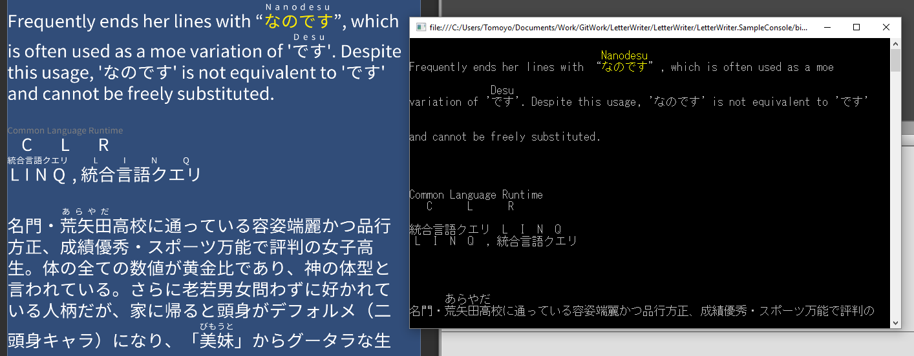

# LetterWriter

Unity向けの日本語テキスト表示ライブラリです。このライブラリ(コンポーネント)を利用することで標準機能ではできないルビ表示、禁則処理といったことが行えます。

例えば会話やお知らせのような文章を表示するのに利用できます。

## 機能

- 拡張性
  - マークアップの拡張
  - 表示処理とレイアウトの分離
    - 実際のレイアウト計算はUnityとは分離されています
- uGUI対応
  - preferredWidth/Height
- 行の高さ自動調整
- 文字色の変更
- 文字サイズの変更
- ルビ
- 禁則処理
- 表示文字数指定
  - 文字を一文字ずつ表示する場合に内容(Text)を変更しておこなうと、禁則処理などの都合で表示中にレイアウトが変わってしまうことがあるのでそれを防ぎます

### 実装予定
- 位置ぞろえ (水平、垂直)
- クリック/タップ
- 下線
- 打消し戦
- 絵文字や画像の表示
